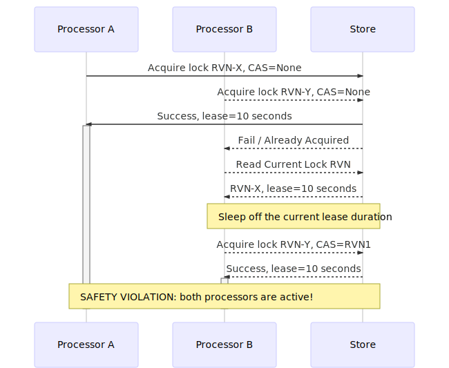

Dynalock [](https://travis-ci.org/ChorusOne/dynalock) [](https://crates.io/crates/dynalock) [](https://docs.rs/dynalock)
========

A [lease] based distributed lock. Dynalock [algorithm] supports lease based
distributed locking implementations through [providers] that support a strongly
consistent Compare-And-Swap (CAS) operation, or at least the compare-and-set variant
and an eventually consistent read operation.

## Usage

Add `dynalock` to the `[dependencies]` section of your Cargo.toml file.

```rust
[dependencies]
dynalock = "^0.1"
```

By only specifying the version of Dynalock you'll automatically use the default
provider (DynamoDB), you can however specify any other provider by adding the
following instead:

```rust
[dependencies.dynalock]
version = "^0.1"
default-features = false
features = ["dynamodb"]
```

## Examples

To use the DynamoDB provider with Dynalock:

```rust
extern crate dynalock;

use std::time::Duration;
use std::thread::sleep;

use dynalock::DistLock;
use dynalock::dynamodb::{DynamoDbDriver, DynamoDbDriverInput};
use dynalock::rusoto_core::Region;
use dynalock::rusoto_dynamodb::DynamoDbClient;

// Tell DynamoDbDriver about the table name and the partition key
let input = DynamoDbInput {
table_name: String::from("some_lock_table"),
partition_key_field_name: String::from("lock_id"),
..Default::default()
};

let client = DynamoDbClient::simple(Region::UsEast1);
let driver = DynamoDbDriver::new(client, &input);
let mut lock = DistLock::new(driver, Duration::from_secs(10));

let instant = lock.acquire_lock(&DynamoDbLockInput::default()).unwrap();

sleep(lock.remining(&instant).unwrap());

println!("Lock has expired!");
```

## Providers

Dynalock default implementation is built on-top of AWS DynamoDB under the `dynamodb`
default crate feature. Provided an implementation, any storage provider or service
that supports the requirements above can be used.

A new provider can easily be implemented by providing an implementation of the
public trait `dynalock::Locking`, specifically the `acquire_lock`, `refresh_lock`
and `release_lock` (optional) methods. Please see the module documentation for
specific implementation details (e.g., `dynalock::providers::dynamodb`).

## Algorithm

The [lease] based Dynalock locking algorithm relies on a CAS primitive and a
monotonic clock per processor. The algorithm provides properties of an advisory lock,
in the sense that no two processors will be able to hold the lock given that each
processor honors the lock lease duration.

A lock item cooperatively synchronizes processors' access to a single shared
conceptual resource. Each lock item has a fence token attribute
(e.g., a Record Version Number or an RVN) which is used for the CAS operation.

[]()

Note that before the lease ends there's an option for us to release the lock before
we try to reacquire it. Releasing the lock acts as a yield to allow other processors
a chance of acquiring the lock when we have a long lease duration.

Since language X is a non-GC language or runtime we could argue that the safety
violation will not occur due to the lack of a garbage collector, except that
GC-pauses are not the only way a process could be paused. A process can be
temporarily stopped for a multitude of reasons:

- An I/O read operation that isn't time bounded by less than the remaining of the
lease duration.
- Application process makes a system call that blocks the process for a period of
time.
- OS scheduler preempts the process due to a hardware interrupt or thread quantum
depletion.

Given that honoring a deadline is a hard problem, it becomes apparent that
there are certain tradeoffs that we have to chose from. For some applications
availability is critical, for others consistency violations are world ending.
Dynalock leases allows us to find a fine-grained balance between these two extreme
requirements.

### Processor Consistency

Increase lease duration beyond any reasonable doubt to detect processor failure. By
increasing the lease duration to several minutes or hours you can confidently
eliminate all doubts around processors missing a deadline due to temporary
interruptions or other operations' latency. In applications that focus on
consistency this is not so bad given that your application requirements can tolerate
a downtime of the lease duration (e.g., lease duration of 1 hour means that your
live processor could be blocked for 1 hour before attempting to acquire the lock).
This approach is suitable for applications where high performance is desirable, as
the lease duration grows you'll be able to process more requests or data before
having to try to acquire the lock again as long as processing a single request
is cheaper than trying to acquire a lock.

### Processor Availability

In order to achieve minimal downtime we decrease the lease duration to the minimum
achievable. Reducing the lease duration requires us to have a much greater control
over the network, the OS and the underlying hardware, minimizing and bounding
overhead latencies as much as possible. For starters a stable and low latency
network link is required as well as a real-time OS scheduler (e.g., Linux's FIFO,
Round Robin or Deadline scheduler) and possibly CPU isolation (e.g., cpusets), how
to configure a [real-time] scheduler or CPU isolation is outside the scope of this
document.

The combination of the above two approaches allows us to find an acceptable balance
for our application and business requirements without forcing on us a particular
trade-off.

## Contributing

Thought of something you'd like to see in Dynalock? You can visit the issue tracker
to check if it was reported or proposed before, and if not please feel free to
create an issue or feature request first to discuss it. Ready to start contributing?
Our [contributing guide][contributing] is a good place to start. If you have
questions please feel free to ask.

[lease]: https://dl.acm.org/citation.cfm?id=74870
[providers]: #providers
[algorithm]: #algorithm
[real-time]: http://linuxrealtime.org/
[contributing]: https://github.com/chorusone/dynalock/blob/master/CONTRIBUTING.md
